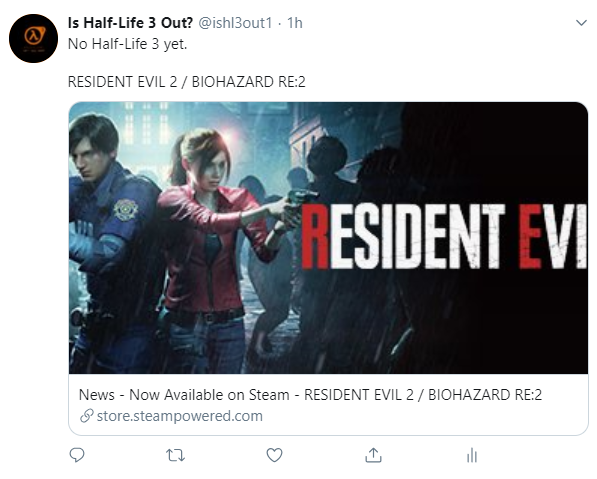

# Half-Life 3 Twitter Bot

A serverless Twitter Bot that Tweets new releases on Steam and if that new release happens to be Half-Life 3.



## Prerequisites

* Python 3.6.x
* [AWS CLI](https://docs.aws.amazon.com/cli/latest/userguide/cli-chap-install.html)
* [Twitter API Credentials](https://developer.twitter.com/en/docs/basics/apps/overview.html)

## Setup

### Create Lambda Function

Add dependencies and Lambda function to a zip archive, then create a Lambda function with the create-function command.

```bash
$ cd package
$ zip -r9 half-life3-bot.zip .
$ cd ..
$ zip -g half-life3-bot.zip half-life3-bot.py
$ aws lambda create-function --function-name half-life3-bot \
--zip-file fileb://half-life3-bot.zip --handler half-life3-bot.handler \
--runtime python3.6 --role arn:aws:iam::123456789012:role/lambda-cli-role
```

Where 123456789012 is the Role arn.

[Additionally, you can also create the Lambda function via the AWS console.](https://docs.aws.amazon.com/lambda/latest/dg/getting-started-create-function.html)  You will need to change the default handler to half-life3-bot.handler.  Then, run `./updateLambda.sh`

### Set Environment Variables

This function assumes you [set and encrypt environment variables](https://docs.aws.amazon.com/lambda/latest/dg/env_variables.html).
